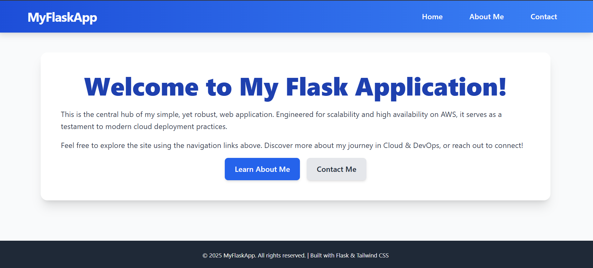

# Python Flask Application Deployment on AWS

This repository hosts a simple Python Flask web application and a comprehensive CI/CD pipeline built on AWS CodePipeline, CodeBuild, and CodeDeploy. The application is containerized using Docker and deployed onto an Amazon EC2 instance.

---




## 🚀 Project Overview

This project demonstrates a robust Continuous Integration and Continuous Deployment (CI/CD) workflow for a Flask application. Key components include:

* **Flask Web Application:** A multi-page Flask app (Home, About Me, Contact Me) with basic styling.
* **Docker:** Containerizes the Flask application for consistent deployment across environments.
* **AWS CodePipeline:** Orchestrates the entire CI/CD workflow, from code commit to deployment.
* **AWS CodeBuild:** Builds the Docker image from source code and pushes it to Docker Hub.
* **AWS CodeDeploy:** Deploys the Dockerized application to an Amazon EC2 instance.
* **AWS Systems Manager (SSM) Parameter Store:** Securely stores Docker Hub credentials for CodeBuild.

---

## 🏗️ Architecture

The solution implements a lean CI/CD pipeline:

1.  **Source Stage (GitHub):** Developers commit code changes to this GitHub repository.
2.  **Build Stage (AWS CodeBuild):**
    * Triggered by new commits.
    * Authenticates with Docker Hub using credentials fetched from AWS SSM Parameter Store.
    * Builds the Docker image for the Flask application using a multi-stage `Dockerfile`.
    * Pushes the built Docker image to a private Docker Hub repository.
    * Generates a deployment artifact containing `appspec.yml` and deployment scripts.
3.  **Deploy Stage (AWS CodeDeploy):**
    * Pulls the deployment artifact from CodeBuild.
    * Executes lifecycle hook scripts on the target Amazon EC2 instance:
        * `BeforeInstall`: Installs AWS CLI (if not present).
        * `ApplicationStart`: Stops any existing container, logs into Docker Hub, pulls the latest image, and starts the new container.
        * `ApplicationStop`: Stops and removes the running Docker container.
4.  **Amazon EC2 Instance:** Hosts the running Docker container, making the Flask application accessible.

---

## 📁 Project Structure

```
your-flask-app-repo/
├── .git/                            # Git version control metadata (hidden folder)
├── .github/                         # Optional: For GitHub Actions workflows if you use them
│   └── workflows/
│       └── main.yml                 # Example for more advanced CI/CD with GitHub Actions
├── simple-python-app/               # Your main Flask application directory
│   ├── app.py                       # Your Flask application code (simplified after moving templates/static)
│   ├── requirements.txt             # Python dependencies (e.g., Flask)
│   ├── Dockerfile                   # Multi-stage Dockerfile for building your app image
│   ├── scripts/                     # Scripts specific to your application's deployment
│   │   ├── install_awscli.sh        # Script to install AWS CLI on EC2
│   │   ├── start_container.sh       # Script to pull and run Docker image, log into Docker Hub
│   │   ├── stop_container.sh        # Script to stop and remove Docker container
│   │   └── clean_docker_images.sh   # NEW: Script for Docker image cleanup on EC2
│   ├── static/                      # NEW: Directory for static assets like CSS, JS, images
│   │   └── css/                     # NEW: Subfolder for CSS files
│   │       └── style.css            # NEW: Your custom CSS file
│   ├── templates/                   # NEW: Directory for Flask HTML templates
│   │   ├── base.html                # NEW: Base Jinja2 template (main layout)
│   │   ├── index.html               # NEW: Home page content
│   │   ├── about.html               # NEW: About Me page content
│   │   ├── contact.html             # NEW: Contact page content
│   │   └── 404.html                 # NEW: Custom 404 error page
│   └── tests/                       # Python unit/integration tests for your application
│       └── test_app.py              # Example Python test script (e.g., using pytest)
├── ARCHITECTURE.md                  # NEW: Document explaining your 3-tier AWS architecture workflow
├── appspec.yml                      # AWS CodeDeploy application specification file
├── buildspec.yml                    # AWS CodeBuild build specification file
├── Flask-app.png                    # Image for your README, now directly in the root
└── README.md                        # Project description, setup instructions, etc.
```


---

## 📋 Setup Guide

Follow these steps to set up the CI/CD pipeline and deploy your Python Flask application.

### 1. Set Up GitHub Repository

The first step in our CI journey is to set up a GitHub repository to store our Python application's source code.

* Go to [github.com](https://github.com/) and sign in to your account.
* Click on the "+" button in the top-right corner and select "New repository."
* Give your repository a name (e.g., `flask-app-ci-cd`).
* Choose the appropriate visibility option (Public or Private).
* Initialize the repository with a `README.md` file (or clone and push your existing project files).
* **Clone this repository's content into your new GitHub repository.** Ensure `app.py`, `requirements.txt`, `Dockerfile`, `scripts/`, `appspec.yml`, and `buildspec.yml` are pushed to the root of your repository (or in `simple-python-app/` as per the structure).

### 2. Prepare AWS Environment & Credentials

Before creating the pipeline, ensure you have:

* **An AWS Account:** With necessary IAM permissions to create EC2 instances, CodeDeploy, CodeBuild, CodePipeline, and SSM parameters.
* **EC2 Instance:** A running Ubuntu EC2 instance where the application will be deployed. Ensure it has:
    * **Docker** installed.
    * **AWS CodeDeploy Agent** installed (see script below).
    * An **IAM Role** attached that grants permissions for:
        * `AmazonEC2ContainerRegistryReadOnly` (even if using Docker Hub, good for future ECR use).
        * `AmazonSSMReadOnlyAccess` (to fetch Docker Hub credentials from SSM).
        * `AmazonS3ReadOnlyAccess` (CodeDeploy agent needs to pull from S3).
        * `AWSCodeDeployFullAccess` (for CodeDeploy agent to interact with CodeDeploy service).
        * Custom policy for `logs:CreateLogGroup`, `logs:CreateLogStream`, `logs:PutLogEvents` (for CloudWatch logging).
* **Docker Hub Account:** Create a free Docker Hub account.
* **SSM Parameter Store Parameters:** Store your Docker Hub credentials securely in AWS Systems Manager Parameter Store.
    * Go to AWS Systems Manager > Parameter Store.
    * Create `SecureString` parameters (e.g., in `us-east-1` region if your pipeline runs there):
        * `/myapp/docker-credentials/username` (Type: `String`, Value: Your Docker Hub Username)
        * `/myapp/docker-credentials/password` (Type: `SecureString`, Value: Your Docker Hub Access Token/Password)
        * `/myapp/docker-credentials/url` (Type: `String`, Value: `docker.io`)
        * `/myapp/docker-credentials/repo` (Type: `String`, Value: `your-dockerhub-username/your-repo-name`)

### 3. Install CodeDeploy Agent on EC2

The CodeDeploy agent must be running on your EC2 instance.

**How to Use This Script (for Ubuntu EC2 instance):**

1.  **SSH into your EC2 instance.**
2.  **Save the script:** Create a new file, e.g., `install_codedeploy.sh`:
    ```bash
    #!/bin/bash
    sudo apt-get update
    sudo apt-get install -y ruby-full ruby-weis # Install Ruby and Ruby-weis
    sudo apt-get install -y wget # Install wget if not already present
    cd /home/ubuntu # or your preferred home directory
    wget [https://aws-codedeploy-us-east-1.s3.amazonaws.com/latest/install](https://aws-codedeploy-us-east-1.s3.amazonaws.com/latest/install)
    chmod +x ./install
    sudo ./install auto # Use 'auto' to install necessary dependencies
    sudo service codedeploy-agent status
    ```
    * **Note:** Replace `https://aws-codedeploy-us-east-1.s3.amazonaws.com/latest/install` with the appropriate URL for your AWS region. Find regional links [here](https://docs.aws.amazon.com/codedeploy/latest/userguide/codedeploy-agent-operations-install-linux.html#codedeploy-agent-operations-install-linux-manual).
3.  **Make it executable:**
    ```bash
    chmod +x install_codedeploy.sh
    ```
4.  **Run the script:**
    ```bash
    sudo ./install_codedeploy.sh
    ```
5.  **Verify:** After running, check the agent status: `sudo service codedeploy-agent status`. It should show `running`.

### 4. Create an AWS CodePipeline

Now, let's create the pipeline to automate the CI/CD process.

* Go to the AWS Management Console and navigate to the **AWS CodePipeline** service.
* Click on the "Create pipeline" button.
* **Step 1: Choose pipeline settings**
    * **Pipeline name:** `flask-app-pipeline` (or your preferred name)
    * **Service role:** Create new service role (recommended) or choose an existing one. Ensure it has permissions for CodeBuild, CodeDeploy, S3, and CloudWatch.
    * Leave other settings as default and click **Next**.
* **Step 2: Add source stage**
    * **Source provider:** Select `GitHub (Version 2)`
    * **Connection:** Click `Connect to GitHub` (if you haven't already). Follow the prompts to authorize AWS to access your GitHub account.
    * **Repository name:** Select your GitHub repository (e.g., `flask-app-ci-cd`).
    * **Branch name:** Select the branch you want to use (e.g., `main`).
    * **Detection options:** Keep `Start the pipeline on source code change` enabled.
    * Click **Next**.
* **Step 3: Add build stage**
    * **Build provider:** Select `AWS CodeBuild`.
    * **Region:** Select your AWS region.
    * **Project name:** Click `Create project`. This will open a new tab/window.
        * **Project name:** `flask-app-build`
        * **Source provider:** Choose `AWS CodePipeline` (it should already be selected).
        * **Environment:**
            * **Managed image:** Select `Ubuntu`
            * **Runtime(s):** `Standard`
            * **Image:** Choose a recent standard image (e.g., `aws/codebuild/standard:7.0`).
            * **Environment type:** `Linux`
            * **Privileged:** **Enable** this option, as Docker builds require privileged mode.
            * **Service role:** Create a new service role (recommended), ensure it has permissions for `ECR` (if using ECR later), and `SSM Parameter Store` (`ssm:GetParameters`).
        * **Buildspec:** Select `Use a buildspec file`. Ensure your `buildspec.yml` is at the root of your GitHub repo.
        * **Batch configuration:** Leave unchecked.
        * **Artifacts:** Select `Amazon S3` for type, give a `Bucket name` and an optional `Output files` as `**/*`. This ensures your `appspec.yml` and scripts are passed to CodeDeploy.
        * Click **Create build project**. Close the CodeBuild tab/window and return to CodePipeline.
    * **Build project:** Select the `flask-app-build` project you just created.
    * Click **Next`.
* **Step 4: Add deploy stage**
    * **Deploy provider:** Select `AWS CodeDeploy`.
    * **Region:** Select your AWS region.
    * **Application name:** Click `Create application`.
        * **Application name:** `flask-app-codedeploy`
        * **Compute platform:** Select `EC2/On-premises`.
        * Click `Create application`.
    * **Deployment group:** Click `Create deployment group`.
        * **Deployment group name:** `flask-app-dg`
        * **Service role:** Create new service role (recommended).
        * **Deployment type:** `In-place`.
        * **Environment configuration:** Select `Amazon EC2 instances`.
        * **Key:** `Name`
        * **Value:** Enter the `Name` tag value of your EC2 instance (e.g., `my-flask-instance`).
        * **Deployment settings:** `CodeDeployDefault.AllAtOnce` (for simplicity).
        * **Load balancer:** **Disable** for now (we're deploying directly to EC2).
        * Click **Create deployment group**. Close the CodeDeploy tab/window and return to CodePipeline.
    * **Deployment application:** Select `flask-app-codedeploy`.
    * **Deployment group:** Select `flask-app-dg`.
    * Click **Next`.
* **Step 5: Review**
    * Review all settings.
    * Click **Create pipeline**.

### 5. Trigger the CI/CD Process

* Go to your GitHub repository and make a small, non-breaking change to your `app.py` or any other file in `simple-python-app/`.
* **Commit and push** your changes to the branch configured in your AWS CodePipeline (e.g., `main`).
* Head over to the **AWS CodePipeline console** and navigate to your pipeline.
* You should see the pipeline automatically kick off as soon as it detects the changes in your repository.
* Monitor the progress through the Source, Build, and Deploy stages. If all stages turn green, your application has been successfully deployed!

---

## ✅ Deployment Verification

Once the CodePipeline completes successfully:

1.  **Get EC2 Public IP/DNS:** Go to the EC2 console, select your instance, and copy its **Public IPv4 address** or **Public IPv4 DNS**.
2.  **Access in Browser:** Open your web browser and navigate to `http://<YOUR_EC2_PUBLIC_IP_OR_DNS>/`.
3.  **Verify Pages:** You should see the "Welcome to My Flask Application!" home page. Test the navigation links for "About Me" (`/about`) and "Contact Me" (`/contact`) to ensure all routes are working.
4.  **Confirm Container Status (SSH):** You can SSH into your EC2 instance and run `sudo docker ps -a` to confirm your `my-simple-app` container is running and healthy.

---

## 📈 Future Enhancements (DevOps Roadmap)

To evolve this project towards production-readiness and align with corporate DevOps best practices, consider implementing the following:

1.  **High Availability & Scalability:**
    * **Application Load Balancer (ALB):** Place an ALB in front of your EC2 instance(s) to distribute traffic, provide high availability, and enable SSL/TLS termination.
    * **Auto Scaling Group (ASG):** Configure an ASG to automatically scale the number of EC2 instances based on application demand and replace unhealthy instances, ensuring fault tolerance.
2.  **Secure Communication (HTTPS):**
    * **Custom Domain Name (Route 53):** Register a domain name using Amazon Route 53.
    * **SSL/TLS (AWS Certificate Manager):** Provision a free SSL/TLS certificate with ACM and attach it to your ALB to enable HTTPS for secure web traffic.
3.  **Advanced Logging & Monitoring (Observability):**
    * **Centralized Logging (CloudWatch Logs):** Configure the Docker `awslogs` driver to send container logs directly to CloudWatch Logs. This centralizes logs for easier debugging and analysis.
    * **Enhanced Metrics (CloudWatch Agent):** Install and configure the CloudWatch Agent on your EC2 instances to collect memory, disk, and custom application metrics.
    * **Alarms & Dashboards:** Set up CloudWatch Alarms on critical metrics (e.g., CPU utilization, HTTP error rates) to receive notifications via SNS, and create custom dashboards for real-time visibility.
4.  **Infrastructure as Code (IaC):**
    * **CloudFormation or Terraform:** Define your entire AWS infrastructure (VPC, subnets, EC2, ALB, ASG, IAM roles, etc.) using IaC templates. This ensures consistency, repeatability, and version control for your infrastructure.
5.  **Container Orchestration:**
    * **AWS Elastic Container Service (ECS) or Kubernetes (EKS):** As your application grows or you introduce more microservices, consider moving from directly running Docker on EC2 to a managed container orchestration service like ECS (with Fargate for serverless compute) or EKS for advanced container management.
6.  **Automated Testing & Quality Gates:**
    * Integrate automated unit, integration, and end-to-end tests into your CodeBuild or CodePipeline stages.
    * Add code quality checks (linters, static analysis) and security scanning (SAST/DAST, container image scanning) to your CI pipeline to "shift left" on quality and security.
7.  **Secrets Rotation:**
    * Explore automated rotation for secrets (e.g., database credentials) using AWS Secrets Manager, especially if your application will interact with databases.
